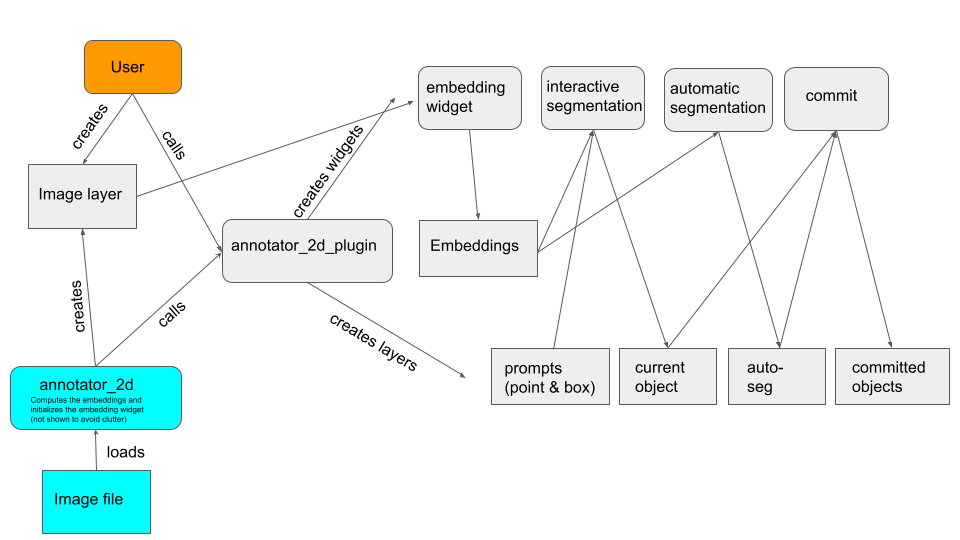

# For Developers

This software consists of four different python (sub-)modules:
- The top-level `micro_sam` module implements general purpose functionality for using Segment Anything for multi-dimension data.
- `micro_sam.evaluation` provides functionality to evaluate Segment Anything models on (microscopy) segmentation tasks.
- `micro_sam.traning` implements the training functionality to finetune Segment Anything on custom segmentation datasets.
- `micro_sam.sam_annotator` implements the interactive annotation tools.

## Annotation Tools

The annotation tools are currently implemented as stand-alone napari applications. We are in the process of implementing them as napari plugins instead (see https://github.com/computational-cell-analytics/micro-sam/issues/167 for details), and the descriptions here refer to the planned architecture for the plugins.

There are four annotation tools:
- `micro_sam.sam_annotator.annotator_2d`: for interactive segmentation of 2d images.
- `micro_sam.sam_annotator.annotator_3d`: for interactive segmentation of volumetric images.
- `micro_sam.sam_annotator.annotator_tracking`: for interactive tracking in timeseries of 2d images.
- `micro_sam.sam_annotator.image_series_annotator`: for applying the 2d annotation tool to a series of images.

An overview of the functionality of the different tools:

| Functionality | annotator_2d | annotator_3d | annotator_tracking |
| ------------- | ------------ | ------------ | ------------------ |
| Interactive segmentation | Yes | Yes | Yes |
| For multiple objects at a time | Yes | No | No |
| Interactive 3d segmentation via projection | No | Yes | Yes |
| Support for dividing objects | No | No | Yes |
| Automatic segmentation   | Yes | Yes (on `dev`) | No |

The functionality for the `image_series_annotator` is not listed because it is identical with the functionality of the `annotator_2d`.

Each tool implements the follwing core logic:
1. The image embeddings (prediction from SAM image encoder) are pre-computed for the input data (2d image, image volume or timeseries). These embeddings can be cached to a zarr file.
2. Interactive (and automatic) segmentation functionality is implemented by a UI based on `napari` and `magicgui` functionality.

Each tool has two different entry points:
- From napari plugin menu, e.g. `plugin->micro_sam->annotator_2d` (This entry point is called *plugin* in the following).
- From the command line, e.g. `micro_sam.annotator_2d -i /path/to/image` (This entry point is called *CLI* in the following).

The tools are implemented their own submodules, e.g. `micro_sam.sam_annotator.annotator_2d` with shared functionality implemented in `micro_sam.sam_annotator.util`. The function `micro_sam.sam_annotator.annotator_2d.annotator_2d_plugin` implements the *plugin* entry point, using the `magicgui.magic_factory` decorator. `micro_sam.sam_annotator.annotator_2d.annotator_2d`  implements the *CLI* entry point; it calls the `annotator_2d_plugin` function internally.
The image embeddings are computed by the `embedding widget` (@GenevieveBuckley: will need to be implemented in your PR), which takes the image data from an image layer.
In case of the *plugin* entry point this image layer is created by the user (by loading an image into napari), and the user can then select in the `embedding widget` which layer to use for embedding computation. 
In case of *CLI* the image data is specified via the `-i` parameter, the layer is created for that image and the embeddings are computed for it automatically.
The same overall design holds true for the other plugins. The flow chart below shows a flow chart with a simplified overview of the design of the 2d annotation tool. Rounded squares represent functions or the corresponding widget and squares napari layers or other data, orange represents the *plugin* enty point, cyan *CLI*. Arrows that do not have a label correspond to a simple input/output relation.

<!---
Source for the diagram is here:
https://docs.google.com/presentation/d/1fMDNBYMYxeqe4dk6OmmFxoI8sYvCu4EPZS_LyTsTg_s/edit#slide=id.p
-->
